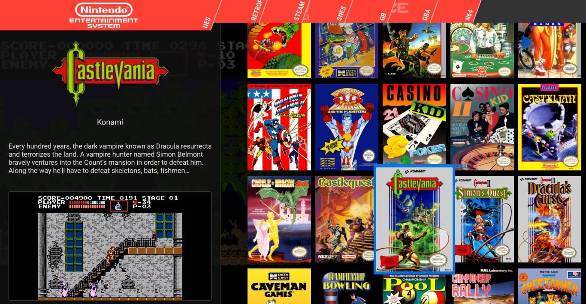
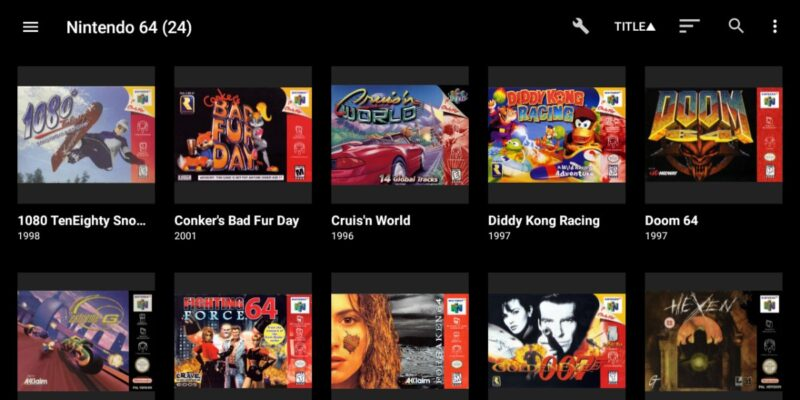

# 📱 Android Emulation Hub

Welcome to the **Android Emulation Hub**!  
Explore free, open-source, and paid emulators for Android, organized by console brand.

---

🚨 **IMPORTANT: Legal Disclaimer** 🚨  

This repository **DOES NOT** support or encourage piracy. It is for informational purposes only.  
📺 **No ROMs or BIOS files are provided.**  
📃 **Emulators are legal, but using ROMs/BIOS files depends on local laws.**  
🔒 **By using this site, you agree to comply with your country's regulations.**  

---

## 🔗 Browse by Brand

| Brand | Page |
|-------|------|
| 🎮 **Multi Emulators** | [Multi Emulators](pages/multi_aio.md) - Emulators supporting multiple platforms. |
| 🏹 **Nintendo** | [Nintendo Emulators](pages/nintendo.md) - Emulators for NES, SNES, GameCube, Switch, etc. |
| 🎨 **Sony** | [Sony Emulators](pages/sony.md) - Emulators for PlayStation 1-5 and PSP. |
| 🔄 **Sega** | [Sega Emulators](pages/sega.md) - From Mega Drive to Dreamcast. |
| 🔵 **Microsoft** | [Microsoft Emulators](pages/microsoft.md) - Emulators for Xbox and more. |
| 🎩 **Atari** | [Atari Emulators](pages/atari.md) - Classic Atari consoles. |
| 🛠 **NEC** | [NEC Emulators](pages/nec.md) - PC Engine, TurboGrafx-16, and more. |
| 🌟 **SNK** | [SNK Emulators](pages/snk.md) - Emulators for Neo Geo. |
| 🛡 **Bandai** | [Bandai Emulators](pages/bandai.md) - WonderSwan and other consoles. |
| 🏆 **Other** | [Other Emulators](pages/others.md) - Everything not covered above. |

---

## 🖥️ Frontend Launchers for Android

Frontend launchers provide an organized and visually appealing way to manage and launch your emulated games. Below are some of the best frontend options available for Android.

| Frontend Launcher | Screenshot (click to enlarge) | Description | Price | Official Site |
|-------------------|----------------------------------|-------------|-------|----------------|
| **Beacon** |  | A lightweight frontend designed for speed and customization. | Free | [Beacon on Play Store](https://play.google.com/store/apps/details?id=com.radikal.gamelauncher) |
| **ES-DE** |  | A powerful, modern frontend with extensive configuration options. | Paid | [ES-DE Official Site](https://es-de.org/) |
| **Daijisho** |  | A stylish and intuitive frontend built specifically for Android devices. | Free | [Daijisho GitHub](https://github.com/TapiocaFox/Daijishou) |
| **LaunchBox** |  | A feature-rich frontend with extensive customization options. | Paid | [LaunchBox Official Site](https://www.launchbox-app.com/) |
| **Pegasus** |  | A highly flexible and open-source frontend. | Free | [Pegasus Frontend](https://pegasus-frontend.org/) |
| **Plain Launcher** |  | A minimalistic and easy-to-use game launcher. | Free | [Plain Launcher GitHub](https://github.com/username/plain-launcher) |
| **Reset Collection** |  | A polished and organized frontend with a clean UI. | Paid | [Reset Collection on Play Store](https://play.google.com/store/apps/details?id=com.example.resetcollection) |
| **Dig Emulator Frontend** |  | One of the most popular frontends, offering deep customization. | Free | [Dig Emulator Frontend on Play Store](https://play.google.com/store/apps/details?id=com.digdroid.alman.dig) |

---

## 🛠️ Drivers & Tools

This section includes useful drivers and tools that can enhance your emulation experience on Android.

- [🔧 Graphics Drivers (Turnip, Mesa)](tools_&_drivers/drivers.md)
- [🕹 Gamepad Mappers (Octopus, Mantis, Panda)](tools_&_drivers/gamepad_mappers.md)
- [✨ Shader Packs (Reshade, RetroArch GLSL)](tools_&_drivers/shaders.md)

More tools will be added soon!

---

🌐 **Visit the [GitHub Repository](https://github.com/Ashnar2602/Android_Emulation) to contribute!**

