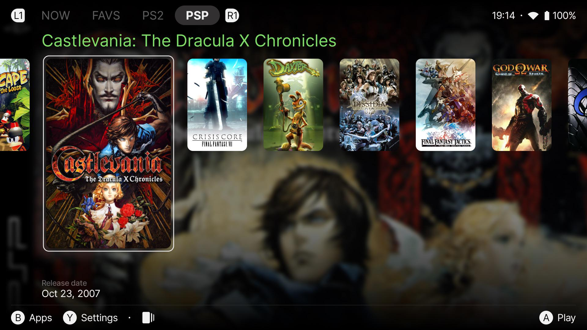
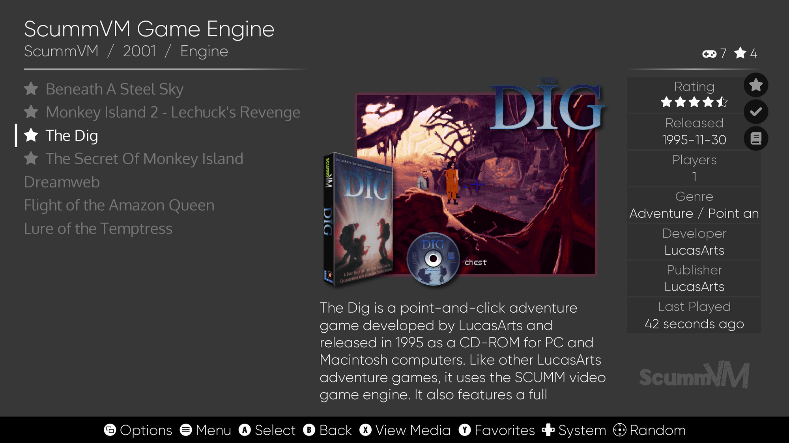
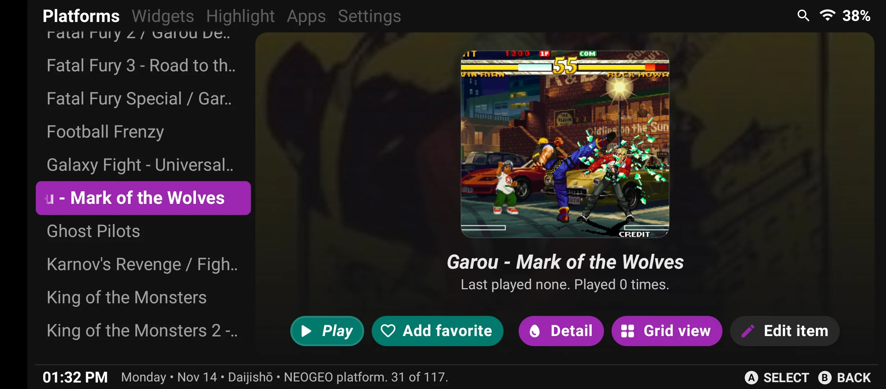

# 📱 Android Emulators Repository

Welcome to the **Android Emulators Repository**!  
Explore free and open-source emulators for Android, organized by console brands.

---

⚠️ **Legal Disclaimer**  
This repository is for **informational purposes only**. It provides links to legal emulators and their official websites or source code repositories.  
We do **not condone or support piracy** in any form. This repository does not host or provide links to ROMs, BIOS files, or any other copyrighted materials.  
Using emulators may require the use of BIOS or ROM files, which are subject to copyright laws. Ensure you have a legal right to use these files in accordance with the laws of your country.

**Key Points:**
- Emulators themselves are legal tools.
- ROMs, BIOS files, and other game-related materials may require you to own an original copy of the game or hardware.
- By using this repository, you agree to take full responsibility for complying with applicable laws.

---

## 🔗 Browse by Brand
- [Multi Emulators](multi_aio.md)
- [Nintendo Emulators](nintendo.md)
- [Sony Emulators](sony.md)
- [Sega Emulators](sega.md)
- [Microsoft Emulators](microsoft.md)
- [Atari Emulators](atari.md)
- [NEC Emulators](nec.md)
- [SNK Emulators](snk.md)
- [Bandai Emulators](bandai.md)
- [Other Emulators](others.md)

---

## 🖥️ Frontend Launchers for Android

Frontend launchers provide an organized and visually appealing way to manage and launch your emulated games. Below are some of the best frontend options available for Android.

| Frontend Launcher | Screenshot | Description | Official Site |
|-------------------|------------|-------------|--------------|
| **Beacon** |  | A lightweight frontend designed for speed and customization. | [Beacon on PlayStore](https://play.google.com/store/apps/details?id=com.radikal.gamelauncher) |
| **ES-DE** |  | A powerful, modern frontend with extensive configuration options. | [ES-DE Official Site](https://es-de.org/) |
| **Daijisho** |  | A stylish and intuitive frontend built specifically for Android devices. | [Daijisho GitHub](https://github.com/TapiocaFox/Daijishou) |

---

⚠️ **Disclaimer**  
This site provides information on legal emulators only. No ROMs or BIOS files are provided.

🌍 Visit the **[GitHub Repository](https://github.com/Ashnar2602/Android_Emulation)** to contribute!
